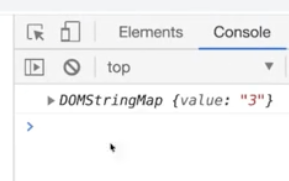

# 목차
- [CSS Transform](https://github.com/sasha1107/Interactive-Web-Study/blob/main/Notes/README.md#css-transform)<br>
- [CSS Transition](https://github.com/sasha1107/Interactive-Web-Study/blob/main/Notes/README.md#CSS-Transition)<br>
- [Animation](https://github.com/sasha1107/Interactive-Web-Study/blob/main/Notes/README.md#Animation)<br>
- [이미지 스프라이트 사용하여 애니메이션 구현](https://github.com/sasha1107/Interactive-Web-Study/blob/main/Notes/README.md#이미지-스프라이트-사용하여-애니메이션-구현)<br>
- [3D](https://github.com/sasha1107/Interactive-Web-Study/blob/main/Notes/README.md#3D)<br>
- [flex](https://github.com/sasha1107/Interactive-Web-Study/blob/main/Notes/README.md#flex)<br>
- [DOM 제어](https://github.com/sasha1107/Interactive-Web-Study/blob/main/Notes/README.md#DOM-제어)<br>
- [이벤트](https://github.com/sasha1107/Interactive-Web-Study/blob/main/Notes/README.md#이벤트)<br>
- [이벤트 위임](https://github.com/sasha1107/Interactive-Web-Study/blob/main/Notes/README.md#이벤트-위임)<br>

# CSS Transform

- scale(크기)
    
    ```css
    /* 크기 2배 */
    transform: scale(2);
    ```
    
- skew(비틀기)
    
    ```css
    transform: skew(30deg);
    transform: skewX(30deg);
    transform: skewY(30deg);
    ```
    
- rotate(회전)
    
    ```css
    transform: rotate(45deg);
    ```
    
- translate
    
    ```css
    /* X축으로 30px Y축으로 10px 이동 */
    transform: translate(30px, 10px);
    ```
    
- 기준점 바꾸기
    
    ```css
    transform-origin: left top;
    
    /* 가로방향위치 세로방향위치 == left top */
    transform-origin: 0% 0%
    
    /* default ⇒  center */
    transform-origin: 50% 50%
    ```

# CSS Transition
- 재생시간
    
    ```css
    transition-duration: .4s
    ```
    
    ```css
    .box {
        width: 100px;
        height: 100px;
        border: 2px solid #000;
        background: rgba(255,255,0,0.7);
        **transition: 1s;**
    }
    .box:hover{
        background: rgba(255,255,255,0.7);
    		transform: scale(1.5);
    }
    ```
    
- 가속도(timing-function)
    
    ```css
    transition-timing-function: ease; /* 기본값 */
    transition-timing-function: linear; /* 등속도 */
    transition: cubic-bezier(0.25, 0.1 0.49 1.73);
    ```
    
    - 크롬 개발자 도구에서 cubic bezier editor 사용하면 더 고급 설정 가능
- 딜레이
    
    ```css
    transition-delay: 1s;
    ```
    
    ```css
    transition: 1s 2s;
    /* transition: 1s(duration) 2s(delay); */
    ```

# Animation
## 축약형

```css
@keyframes box-ani {
    0% {
        transform: translate(0,0);
    }
    25% {
        transform: translate(300px, 0);
    }
    50% {
        transform: translate(300px,300px);
    }
    75% {
        transform: translate(0, 300px);
    }
    100% {
        transform: translate(0,0);
    }
}
.box {
    animation: box-ani 1.5s linear infinite;
}
```

## animation-name
* @keyframes로 선언한 애니메이션 이름을 적어주기

    ```css
    animation-name : box-ani;
    ```

## animation-duration

- 지속시간
    
    ```css
    animation-duration: 1.5s;
    ```
    

## animation-delay

엘리먼트가 로드되고 나서 언제 애니메이션이 시작될지 지정합니다.

```css
animation-delay: 0s;
```

## animation-timing-function

중간 상태들의 전환을 어떤 시간간격으로 진행할지 지정

- 가속도 조절
    
    ```css
    animation-timing-function: ease; /* 기본값 */
    animation-timing-function: linear; /* 등속도 */
    animation: cubic-bezier(0.25, 0.1 0.49 1.73);
    ```
    
    - 크롬 개발자 도구에서 cubic bezier editor 사용하면 더 고급 설정 가능

## animation-iteration-count

애니메이션이 몇 번 반복될지 지정

```css
animation-iteration-count: infinite; /* 무한반복 */
animation-iteration-count: 2; /* 2번 실행 */
```

## animation-direction

애니메이션이 종료되고 다시 처음부터 시작할지 역방향으로 진행할지 지정

- alternate(왔다갔다)
    
    ```css
    animation-direction: alternate;
    ```
    
- 역방향으로 진행
    
    ```css
    animation-direction: reverse;
    ```
    
- alternate-reverse
    
    ```css
    animation-direction: alternate-reverse;
    ```
    

## animation-fill-mode

애니메이션이 시작되기 전이나 끝나고 난 후 어떤 값이 적용될지 지정합니다.

- `none`

    애니메이션은 실행되지 않을 때 대상에 스타일을 적용하지 않습니다. 요소는 대신 적용된 다른 CSS 규칙을 사용하여 표시됩니다. 이것은 기본값입니다.

- `forwards`

    대상은 실행 된 애니메이션의 마지막 [keyframe (en-US)](https://developer.mozilla.org/en-US/docs/Web/CSS/@keyframes)에 의해 설정된 계산 된 값을 유지합니다. 마지막 키 프레임은 [animation-direction](https://developer.mozilla.org/ko/docs/Web/CSS/animation-direction)및 [animation-iteration-count (en-US)](https://developer.mozilla.org/en-US/docs/Web/CSS/animation-iteration-count)의 값에 따라 다릅니다.

- `backwards`

    애니메이션은 대상에 적용되는 즉시 첫 번째 관련 [keyframe (en-US)](https://developer.mozilla.org/en-US/docs/Web/CSS/@keyframes) 에 정의 된 값을 적용하고 [animation-delay](https://developer.mozilla.org/ko/docs/Web/CSS/animation-delay) 기간 동안 이 값을 유지합니다. 첫 번째 관련 키프레임은 [animation-direction](https://developer.mozilla.org/ko/docs/Web/CSS/animation-direction)의 값에 따라 다릅니다.

- `both`

    애니메이션은 앞뒤 양쪽 모두의 규칙을 따르므로 애니메이션 속성이 양방향으로 확장됩니다.

## animation-play-state

애니메이션을 멈추거나 다시 시작할 수 있습니다.

- runnig 실행
- paused 일시정지 (호버 시 정지하게 하는 등)


# 이미지 스프라이트 사용하여 애니메이션 구현
- div 크기를 설정해놓고
- background. 이미지를 옆으로 계속 이동하기


    ✅ 이미지 크기는 레티나 디스플레이 지원을 위해 원래 구현할 크기의 2배로 하는 것을 권장한다.


- 이미지 사이즈 5100 * 300px
- 레티나 디스플레이 지원을 위해 이미지의 크기가 구현할 크기의 2배이므로 절반으로 줄여줘야 함
    
    ```css
    background: url('/images/sprite_spaceship.png') no-repeat 0 0 / auto 150px;
    
    // 간단하게
    background-size = auto 150px;
    ```
    - width나 height 중 계산하기 쉬운 값을 계산하여 고정해주고 나머지 속성은 auto로 주면 간단!

- 애니메이션 만들기
    ```css
    @keyframes spaceship-ani {
            to {
                background-position: -2550px 0;
            }
        }
    .spaceship {
        width: 150px;
        height: 150px;
        background: url('images/sprite_spaceship.png') no-repeat 0 0 / cover;
        animation: spaceship-ani 1s infinite steps(17);
    }
    ```

# 3D
## 카드 뒤집기
- 카드 돌릴 때 앞면과 뒷면 이미지 제작
- 앞면과 뒷면을 position absolute로 겹쳐주기
- 카드 앞면, 뒷면 카드 컨테이너를 부모 컨테이너로 감싸줌
    - 부모 컨테이너는 position relative

# flex
## flex : 1

    - 축약형
    - flex-basis: 0
    - flex-grow: 1
- flex item(자식)에게 주는 속성
- item 들이 동일한 크기를 가지도록 함

# DOM 제어

## DOM 요소 생성

```jsx
const pEl = document.createElement('p');
```

### DOM 요소에 내용 넣기

```jsx
pEl.innerHTML = '<a href="#">하하</a>';
```

- 결과
    
    ```html
    <p>
    	<a href="#">하하</a>
    </p>
    ```
    

### appendChild

```jsx
부모요소.appendChild(자식이될요소)
```

### removeChild

```jsx
부모요소.removeChild(삭제할자식요소)
```

## DOM으로 클래스 제어

### 클래스 추가

```jsx
요소.classList.add('special')
```

### 클래스 제거

```jsx
요소.classList.remove('special')
```

### 클래스 토글

```jsx
요소.classList.toggle('special')
```

# 이벤트

## 이벤트 추가(클릭 이벤트)

```jsx
요소.addEventListener('click', function(){
	요소.classList.add('special')
})
```

## 이벤트 객체

어떤 요소에 이벤트를 등록하면 첫번째 매개변수로 들어오는 객체, e라고 표기하는 것이 일반적이다.

```jsx
function clickHandler(e){
	console.log(this)
	console.log(e.currentTarget)
	console.log(e.target)
}

characters.addEventListener.addEventListener('click', clickHandler)
```

- e
    - 지금 발생하는 이벤트에 대한 정보들을 담고 있는 객체
- e.currentTarget === this
    - 이벤트가 등록되어 있는 객체
- e.target
    - 내가 딱 클릭(클릭 이벤트라면)한 요소


# 이벤트 위임

addEventListener 많이 다는 것은 성능상 좋지 않다.

부모 요소 안에 여러 개의 자식 요소가 있고, 자식 요소들에게 동일한 이벤트를 달고 싶다면

부모 요소에게 이벤트를 주고 위임 시키도록 한다. 

## 예시 1) 이벤트 위임 전 코드

```html
<div class="stage">
	<div class="ilbuni a"></div>
	<div class="ilbuni b"></div>
  <div class="ilbuni c"></div>
</div>

// 자식 요소 전부에게 이벤트를 달아준다. 
<script>
	document.querySelectorAll('ilbuni').addEventListener('click', handleClick)
</script>
```

## 예시 1) 부모에게 이벤트를 주고 위임

```html
<div class="stage">
        <div class="ilbuni a"></div>
        <div class="ilbuni b"></div>
        <div class="ilbuni c"></div>
    </div>

    <script>
    (function() {
        // 이벤트 위임
        const stage = document.querySelector('.stage');

        function clickHandler(e) {
            if (e.target.classList.contains('ilbuni')) {
                stage.removeChild(e.target);
            }
        }

        stage.addEventListener('click', clickHandler);
    })();
    </script>
```

## 예시 2) CSS에서 제어

- 자식 요소인데 이벤트를 안받고 싶을 때
    - 예)버튼 안의 이미지 태그와 span 태그
    
    ```html
    <div class="menu">
        <button class="menu-btn">
            
            <span class="btn-label">일분이 1</span>
        </button>
        <button class="menu-btn">
            
            <span class="btn-label">일분이 2</span>
        </button>
        <button class="menu-btn">
            
            <span class="btn-label">일분이 3</span>
        </button>
    </div>
    ```
    

```css
.icon{
	pointer-events: none;
}

.btn-label {
	pointer-events: none;
}
```

## 예시 2) 자바스크립트에서 제어(dataset 객체)

```html
<div class="menu">
    <button class="menu-btn" data-value="1">
        
        <span class="btn-label">일분이 1</span>
    </button>
    <button class="menu-btn" data-value="2">
        
        <span class="btn-label">일분이 2</span>
    </button>
    <button class="menu-btn" data-value="3">
        
        <span class="btn-label">일분이 3</span>
    </button>
</div>
<script>
	const menu = document.querySelector('.menu');

	function clickHandler(e) {
    console.log(event.target.dataset)
		console.log(event.target.dataset.value)
	}

	menu.addEventListener('click', clickHandler);
</script>
```

- `data-`접두어로 시작하는 프로퍼티들을 모아 객체 형태로 보여줌
    

## 예시2) 최종 코드

```html
<body>
    <div class="menu">
        <button class="menu-btn">
            
            <span class="btn-label">일분이 1</span>
        </button>
        <button class="menu-btn">
            
            <span class="btn-label">일분이 2</span>
        </button>
        <button class="menu-btn">
            
            <span class="btn-label">일분이 3</span>
        </button>
    </div>

    <script>
        // 이벤트 위임
        const menu = document.querySelector('.menu');

        function clickHandler(e) {
            let elem = event.target;
            // menu-btn이 나타날 때까지 체크
            while (!elem.classList.contains('menu-btn')){
                elem = elem.parentNode; // 부모를 타고 올라가며 탐색

                if (elem.nodeName === 'body'){ // 더 이상 타고 올라가지 않도록 
                    elem = null;
                    return;
                }
            }
            console.log(elem.dataset.value)
        }

        menu.addEventListener('click', clickHandler);
    </script>
</body>
```